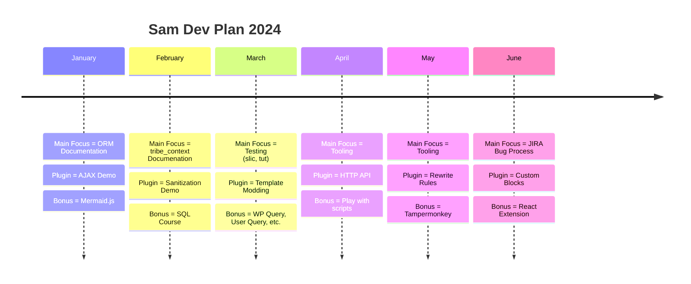

```mermaid
timeline
        title Sam Dev Plan 2024
        January
        : Main Focus = ORM Documentation
        : Plugin = AJAX Demo
        : Bonus = Mermaid.js
        February
        : Main Focus = tribe_context Documenation
        : Plugin = Sanitization Demo
        : Bonus = SQL Course
        March 
        : Main Focus = Testing <br> (slic, tut)
        : Plugin = Template Modding
        : Bonus = WP Query, User Query, etc. 
        April
        : Main Focus = Tooling
        : Plugin = HTTP API
        : Bonus = Play with scripts
        May
        : Main Focus = Tooling
        : Plugin = Rewrite Rules
        : Bonus = Tampermonkey
        June
        : Main Focus = JIRA Bug Process
        : Plugin = Custom Blocks
        : Bonus = React Extension 
```
