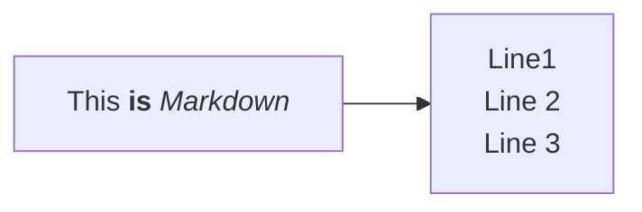
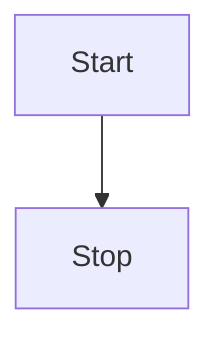

# Brain Dump

## Breaking Things Into Smaller Tasks
- [ ] Start a document for road map of 2024 Dev Plan 
  - Use this repo and [Mermaid.js](https://mermaid.js.org/)
- [ ] Write out all tasks/goals
- [ ] Prioritize tasks
- [ ] Use prioritization to draft timeline
- [ ] Brainstorm how to stay organized - restructure these notes? 

## Draft of Road Map

- Discipline Competencies _GOAL: improve by end of 2024_
  - WordPress
    - Work through each of the 6 documentation sections [here](https://developer.wordpress.org/)
    - Create a small plugin that demonstrates each concept:
      - AJAX
      - HTTP API (Request vs REST ?)
      - Rewrite Rules
      - Sanitization
      - WP Query, User Query, Meta Query
      - Custom Blocks
  - Frontend
    - Create an extension that adds dark/light mode to all calendars
    - Play with an extension that uses React
  - Backend
    - SQL Course [like this](https://mystery.knightlab.com/)
  - Testing
  - Tooling
  - Libraries/Tools
    - Write a script that can automate WP-CLI commands (turn into extension?)
    - Use TamperMonkey to automate regular tasks on ZD 
  - Expediting
    - Learn Mermaid.js for UML
    - ORM Documentation 
- ORM Documentation _GOAL: End of January_
  - Create
  - Read/Query
  - Update
  - Delete 
- Dev Rants ? 

### Testing Mermaid Installation

